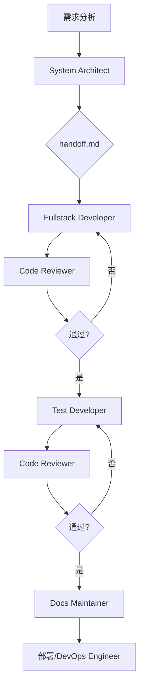

# 🚀 AI Agent 协作开发系统用户手册

> 版本: 1.0  
> 最后更新: 2024年

---

## 📖 目录

1. [系统概述](#系统概述)
2. [快速入门](#快速入门)
3. [Agent 详细指南](#agent-详细指南)
4. [工作流程详解](#工作流程详解)
5. [实战案例](#实战案例)
6. [高级用法](#高级用法)
7. [最佳实践](#最佳实践)
8. [故障排除](#故障排除)
9. [附录](#附录)

---

## 系统概述

### 什么是 AI Agent 协作系统？

AI Agent 协作系统是一个基于专业分工的软件开发框架，通过多个专门的 AI Agent 协同工作，实现高质量的软件开发生命周期管理。每个 Agent 都专注于特定的开发领域，通过标准化的交接流程确保信息的一致性和完整性。

### 核心特性

- **专业分工**: 7个专门化的 Agent，各司其职
- **模型优化**: 根据任务特性选择最适合的模型和工具
- **标准化流程**: 通过 handoff.md 实现无缝协作
- **质量保证**: 内置代码审查和测试流程
- **文档同步**: 自动化的文档维护机制

### 系统架构

```
┌─────────────────────────────────────────────────────────────┐
│                    AI Agent 协作系统                         │
├─────────────────────────────────────────────────────────────┤
│  Opus 模型 Agents (Claude Code)                             │
│  ├── System Architect    (系统架构)                         │
│  ├── Fullstack Developer  (全栈开发)                         │
│  ├── Test Developer       (测试开发)                         │
│  ├── Docs Maintainer      (文档维护)                         │
│  └── DevOps Engineer     (运维工程)                         │
├─────────────────────────────────────────────────────────────┤
│  专用 CLI Agents                                           │
│  ├── Code Reviewer        (代码审查 - Codex CLI)             │
│  └── Gemini Analyzer      (代码分析 - Bash)                 │
└─────────────────────────────────────────────────────────────┘
```

---

## 快速入门

### 1. 环境准备

#### 必需工具

```bash
# 检查 Git 版本
git --version  # 需要 2.0+

# 检查 Node.js 版本
node --version  # 需要 16.0+

# 检查 Claude CLI
claude --version  # 确保已安装

# 可选: 包管理器
pnpm --version  # 推荐 8.0+
# 或
npm --version   # 需要 8.0+
```

#### 项目结构设置

```bash
# 克隆项目模板
git clone <your-repo-url>
cd <project-name>

# 初始化项目结构
mkdir -p .claude/agents
mkdir -p .claude/rules
mkdir -p docs

# 复制 Agent 配置文件
cp -r template/.claude/agents/* .claude/agents/
cp -r template/.claude/rules/* .claude/rules/
```

### 2. 配置文件说明

#### Agent 配置文件结构

每个 Agent 都有一个标准的配置文件格式：

```yaml
---
name: <agent-name>
description: <when-to-use-this-agent>
model: <model-name>  # opus 或不指定
color: <ui-hint>
tools: <tool-list>
---
```

#### 规则文件结构

```
.claude/rules/
├── README.md           # 规则索引
├── coding-style.md     # 编码规范
├── docs.md            # 文档标准
├── code-review.md     # 审查标准
├── testing.md         # 测试标准
└── devops.md          # 运维标准
```

### 3. 第一个任务：创建用户管理功能

让我们通过一个完整的示例来体验系统：

#### 步骤 1: 启动系统架构师

```bash
# 在项目根目录
claude -f .claude/agents/system-architect.md
```

**输入提示**:
```
我需要设计一个用户管理模块，包含以下功能：
1. 用户注册和登录
2. 用户资料管理
3. 用户权限控制
4. 用户列表和搜索

技术栈：Next.js 14, TypeScript, Prisma, PostgreSQL
```

**预期输出**：
- 生成 `handoff.md` 文件
- 包含完整的架构设计
- 数据库模型设计
- API 接口规范
- 前端组件结构

#### 步骤 2: 全栈开发实现

```bash
claude -f .claude/agents/fullstack-developer.md
```

**开发者会**：
1. 读取 `handoff.md`
2. 实现数据库模型
3. 创建 API 路由
4. 开发前端组件
5. 更新任务状态

#### 步骤 3: 代码审查

```bash
claude -f .claude/agents/code-reviewer.md
```

**审查内容包括**：
- 代码质量检查
- 安全性验证
- 性能优化建议
- 标准合规性

#### 步骤 4: 测试覆盖

```bash
claude -f .claude/agents/test-developer.md
```

**测试类型**：
- 单元测试
- 集成测试
- E2E 测试

#### 步骤 5: 文档更新

```bash
claude -f .claude/agents/docs-maintainer.md
```

---

## Agent 详细指南

### 1. System Architect (系统架构师)

**配置**：
- 模型: Opus
- 工具: Claude Code

**核心职责**：
- 需求分析和系统设计
- 技术选型决策
- 架构模式定义
- 任务分解和规划

**使用场景**：
- 新功能开发前的架构设计
- 系统重构方案制定
- 技术债务评估
- 性能瓶颈分析

**最佳实践**：
- 始终从项目整体角度思考
- 考虑可扩展性和维护性
- 提供多种方案对比
- 明确技术选型理由

**输入示例**：
```
请设计一个实时聊天系统，需要支持：
1. 私聊和群聊功能
2. 消息持久化
3. 在线状态显示
4. 消息推送

预算限制：中等规模，日活用户 10 万
```

### 2. Fullstack Developer (全栈开发者)

**配置**：
- 模型: Opus
- 工具: Claude Code

**核心职责**：
- 功能实现和代码编写
- API 接口开发
- 前端组件构建
- 数据库操作实现

**使用场景**：
- 新功能开发
- Bug 修复
- 功能优化
- 代码重构

**最佳实践**：
- 严格遵循架构设计
- 编写清晰可读的代码
- 添加必要的注释
- 考虑错误处理

**注意事项**：
- 不负责测试用例编写
- 不负责文档更新
- 不进行架构决策

### 3. Test Developer (测试开发者)

**配置**：
- 模型: Opus
- 工具: Claude Code

**核心职责**：
- 单元测试编写
- 集成测试设计
- E2E 测试实现
- 测试文档维护

**测试标准**：
- 代码覆盖率 > 80%
- 关键路径 100% 覆盖
- 测试用例独立可重复
- 清晰的测试文档

**测试结构**：
```
test/
├── unit/           # 单元测试
│   ├── services/
│   ├── components/
│   └── utils/
├── integration/    # 集成测试
│   ├── api/
│   └── database/
└── e2e/           # 端到端测试
    ├── auth/
    └── flows/
```

### 4. Docs Maintainer (文档维护者)

**配置**：
- 模型: Opus
- 工具: Claude Code

**核心职责**：
- API 文档生成
- 用户手册编写
- 开发者指南维护
- 文档一致性检查

**文档类型**：
- 技术文档
- 用户指南
- API 参考
- 部署文档

**最佳实践**：
- 保持文档简洁明了
- 提供代码示例
- 定期更新文档
- 维护文档链接

### 5. DevOps Engineer (运维工程师)

**配置**：
- 模型: Opus
- 工具: Claude Code

**核心职责**：
- CI/CD 流水线配置
- 环境管理
- 依赖管理
- 监控和日志

**工具栈**：
- Docker 容器化
- Kubernetes 编排
- GitHub Actions
- 监控工具集成

### 6. Code Reviewer (代码审查者)

**配置**：
- 模型: 不指定
- 工具: Codex CLI

**核心职责**：
- 代码质量检查
- 安全漏洞扫描
- 性能问题识别
- 编码规范验证

**审查清单**：
- [ ] 代码符合项目规范
- [ ] 无安全漏洞
- [ ] 性能可接受
- [ ] 测试覆盖率足够
- [ ] 文档已更新

### 7. Gemini Analyzer (Gemini 分析器)

**配置**：
- 模型: 不指定
- 工具: Bash

**核心职责**：
- 大规模代码分析
- 模式识别
- 架构评估
- 依赖关系分析

**使用场景**：
- 代码库迁移评估
- 技术债务分析
- 架构一致性检查
- 最佳实践识别

---

## 工作流程详解

### 标准开发流程



### 1. 需求收集阶段

**输入**：
- 产品需求文档
- 用户故事
- 技术约束
- 时间要求

**活动**：
- 与利益相关者沟通
- 技术可行性评估
- 资源需求分析
- 风险评估

**输出**：
- 清晰的需求规格
- 技术方案选项
- 初步时间估算
- 依赖关系图

### 2. 架构设计阶段

**System Architect 活动**：
1. 分析需求文档
2. 选择技术栈
3. 设计系统架构
4. 定义接口规范
5. 分解开发任务

**交付物**：
- `handoff.md` - 包含完整的设计方案
- 架构图
- 数据库 ER 图
- API 文档
- 任务清单

### 3. 开发实现阶段

**Fullstack Developer 工作流**：
1. 阅读 `handoff.md`
2. 搭建开发环境
3. 实现数据模型
4. 开发后端 API
5. 构建前端界面
6. 本地测试

**编码规范**：
- 遵循项目编码标准
- 使用 TypeScript 类型
- 编写清晰的注释
- 实现错误处理

### 4. 质量保证阶段

#### 代码审查流程

1. **静态分析**
   - 代码风格检查
   - 类型安全验证
   - 依赖漏洞扫描

2. **动态分析**
   - 功能测试
   - 性能测试
   - 安全测试

3. **人工审查**
   - 架构一致性
   - 代码可读性
   - 最佳实践

#### 测试流程

1. **单元测试**
   - 测试最小功能单元
   - Mock 外部依赖
   - 覆盖率统计

2. **集成测试**
   - API 端点测试
   - 数据库集成
   - 服务间通信

3. **E2E 测试**
   - 用户场景模拟
   - 浏览器自动化
   - 性能监控

### 5. 部署运维阶段

**DevOps 任务**：
- 环境配置
- CI/CD 流水线
- 监控告警
- 日志管理
- 备份恢复

**部署策略**：
- 蓝绿部署
- 金丝雀发布
- 滚动更新
- 灰度发布

---

## 实战案例

### 案例 1: 电商平台订单系统

#### 项目背景
构建一个完整的订单管理系统，包含商品管理、购物车、订单处理、支付集成等功能。

#### 实施步骤

**第 1 天: 架构设计**
```bash
# 启动架构师
claude -f .claude/agents/system-architect.md

# 输入需求：
"""
设计电商订单系统，需要支持：
- 商品管理（CRUD）
- 购物车功能
- 订单创建和管理
- 支付集成（微信、支付宝）
- 订单状态追踪
- 退款处理

技术要求：
- 微服务架构
- 高可用性
- 支持百万级订单
"""
```

**第 2-3 天: 服务开发**
```bash
# 开发商品服务
claude -f .claude/agents/fullstack-developer.md

# 开发订单服务
claude -f .claude/agents/fullstack-developer.md

# 开发支付服务
claude -f .claude/agents/fullstack-developer.md
```

**第 4 天: 测试和审查**
```bash
# 单元测试
claude -f .claude/agents/test-developer.md

# 集成测试
claude -f .claude/agents/test-developer.md

# 代码审查
claude -f .claude/agents/code-reviewer.md
```

**第 5 天: 部署和文档**
```bash
# API 文档
claude -f .claude/agents/docs-maintainer.md

# 部署配置
claude -f .claude/agents/devops-engineer.md
```

#### 项目成果
- 5 个微服务
- 200+ API 端点
- 95% 测试覆盖率
- 完整的文档体系

### 案例 2: 数据分析平台重构

#### 项目背景
将原有的单体数据分析平台重构为微服务架构，提升系统的可扩展性和维护性。

#### 挑战
- 大量遗留代码
- 复杂的数据依赖
- 不能停机迁移
- 性能要求高

#### 解决方案

**1. 现状分析**
```bash
# 使用 Gemini Analyzer 分析代码库
claude -f .claude/agents/gemini-analyzer.md

# 提示：
"""
分析整个代码库，识别：
1. 模块间的依赖关系
2. 性能瓶颈
3. 技术债务
4. 重构机会
"""
```

**2. 重构计划**
```bash
# 架构师制定重构方案
claude -f .claude/agents/system-architect.md
```

**3. 增量重构**
- 按模块逐步拆分
- 保持系统可用性
- 同步编写测试
- 数据迁移策略

#### 关键经验
- 充分的代码分析至关重要
- 增量重构优于大爆炸式
- 测试是重构的安全网
- 文档要及时更新

---

## 高级用法

### 1. 自定义 Agent

虽然系统提供了 7 个标准 Agent，但您可以根据项目需求创建自定义 Agent。

#### Agent 模板

```yaml
---
name: custom-agent
description: 专门处理特定任务的 Agent
model: opus
color: purple
tools: Claude Code
---

# Agent 描述
You are a specialist agent for [specific domain].

## Responsibilities
1. [主要职责]
2. [次要职责]

## Boundaries
- **You handle**: [你的职责范围]
- **You don't handle**: [不处理的任务]

## Working Process
1. [工作步骤 1]
2. [工作步骤 2]
```

### 2. Agent 链式调用

对于复杂任务，可以链式调用多个 Agent：

```bash
# 示例: 完整的功能开发流程
{
  "agents": [
    "system-architect",
    "fullstack-developer",
    "test-developer",
    "docs-maintainer"
  ],
  "handoff_strategy": "accumulate",
  "context_retention": true
}
```

### 3. 并行工作模式

对于大型项目，可以并行启动多个 Agent：

```bash
# 并行开发不同模块
# 终端 1: 用户模块开发
claude -f .claude/agents/fullstack-developer.md -m "用户模块"

# 终端 2: 订单模块开发
claude -f .claude/agents/fullstack-developer.md -m "订单模块"

# 终端 3: 通用组件开发
claude -f .claude/agents/fullstack-developer.md -m "通用组件"
```

### 4. 手动编辑 handoff.md

有时候需要手动编辑交接文档：

```markdown
## 任务交接记录

### 上游: System Architect
- 完成了整体架构设计
- 定义了 API 规范
- 识别了技术风险点

### 当前: Fullstack Developer
- [x] 完成数据库模型
- [x] 实现 API 基础框架
- [ ] 实现业务逻辑
- [ ] 编写单元测试

### 下游: Test Developer 注意事项
- 重点测试权限控制逻辑
- 需要模拟高并发场景
- 注意数据一致性验证
```

### 5. 集成外部工具

系统可以集成各种外部工具：

#### 代码质量工具
- ESLint/Prettier
- SonarQube
- CodeClimate

#### 测试工具
- Jest
- Cypress
- Playwright

#### 部署工具
- Docker
- Kubernetes
- Terraform

---

## 最佳实践

### 1. 项目初始化

#### 推荐的项目结构
```
project-root/
├── .claude/
│   ├── agents/           # Agent 配置
│   └── rules/            # 项目规则
├── docs/                # 项目文档
├── src/                 # 源代码
│   ├── components/      # 组件
│   ├── pages/          # 页面
│   ├── lib/            # 工具库
│   ├── services/       # 服务
│   └── types/          # 类型定义
├── test/               # 测试
├── .gitignore
├── package.json
├── README.md
└── handoff.md         # 任务交接文档
```

#### 初始化脚本
```bash
#!/bin/bash
# init-project.sh

echo "初始化新项目..."

# 创建目录结构
mkdir -p .claude/{agents,rules}
mkdir -p {src,test,docs}/{components,services,types}

# 复制配置文件
cp -r ~/.claude/templates/* .claude/

# 初始化 Git
git init
git add .
git commit -m "Initial project structure"

echo "项目初始化完成！"
```

### 2. 代码规范

#### TypeScript 规范
```typescript
// 好的示例
interface UserService {
  getUserById(id: string): Promise<User | null>;
  createUser(data: CreateUserDto): Promise<User>;
  updateUser(id: string, data: UpdateUserDto): Promise<User>;
}

class UserServiceImpl implements UserService {
  constructor(private userRepository: UserRepository) {}
  
  async getUserById(id: string): Promise<User | null> {
    if (!id) {
      throw new ValidationError('User ID is required');
    }
    return this.userRepository.findById(id);
  }
}
```

#### 组件规范
```tsx
// React 组件示例
interface UserProfileProps {
  user: User;
  onEdit?: (user: User) => void;
  onDelete?: (id: string) => void;
}

const UserProfile: React.FC<UserProfileProps> = ({
  user,
  onEdit,
  onDelete
}) => {
  return (
    <div className="user-profile">
      <Avatar src={user.avatar} alt={user.name} />
      <div className="user-info">
        <h2>{user.name}</h2>
        <p>{user.email}</p>
      </div>
      <div className="user-actions">
        <Button onClick={() => onEdit?.(user)}>编辑</Button>
        <Button 
          variant="danger" 
          onClick={() => onDelete?.(user.id)}
        >
          删除
        </Button>
      </div>
    </div>
  );
};
```

### 3. 测试策略

#### 测试金字塔
```
         /\
        /  \
       /E2E \
      /------\
     /Integration\
    /------------\
   /   Unit      \
  /--------------\
```

- 单元测试 (70%): 快速、隔离、可靠
- 集成测试 (20%): 验证组件间交互
- E2E 测试 (10%): 验证完整用户流程

#### 测试示例
```typescript
// 单元测试
describe('UserService', () => {
  let service: UserService;
  let repository: Mock<UserRepository>;
  
  beforeEach(() => {
    repository = new Mock<UserRepository>();
    service = new UserServiceImpl(repository);
  });
  
  it('should return user by ID', async () => {
    const user = createUser();
    repository.findById.mockResolvedValue(user);
    
    const result = await service.getUserById('123');
    
    expect(result).toEqual(user);
    expect(repository.findById).toHaveBeenCalledWith('123');
  });
});

// 集成测试
describe('User API', () => {
  let app: Express;
  let db: Connection;
  
  beforeAll(async () => {
    db = await createTestConnection();
    app = createApp(db);
  });
  
  it('should create user via API', async () => {
    const userData = {
      name: 'Test User',
      email: 'test@example.com'
    };
    
    const response = await request(app)
      .post('/api/users')
      .send(userData)
      .expect(201);
    
    expect(response.body).toMatchObject({
      name: userData.name,
      email: userData.email
    });
  });
});
```

### 4. 文档维护

#### 文档类型矩阵

| 文档类型 | 目标读者 | 更新频率 | 维护者 |
|---------|---------|---------|--------|
| API 文档 | 开发者 | 每次发布 | Docs Maintainer |
| 用户手册 | 用户 | 每月 | 产品经理 |
| 部署文档 | 运维 | 需要时 | DevOps Engineer |
| 架构文档 | 架构师 | 重大变更 | System Architect |

#### 文档自动化
```yaml
# .github/workflows/docs.yml
name: Generate Documentation
on:
  push:
    branches: [main]
    
jobs:
  docs:
    runs-on: ubuntu-latest
    steps:
      - uses: actions/checkout@v4
      - name: Setup Node.js
        uses: actions/setup-node@v4
      - name: Generate API docs
        run: |
          npm run docs:generate
      - name: Deploy docs
        run: |
          npm run docs:deploy
```

### 5. 性能优化

#### 代码级别优化
```typescript
// 使用缓存
class CachedUserService {
  private cache = new Map<string, User>();
  
  async getUserById(id: string): Promise<User | null> {
    if (this.cache.has(id)) {
      return this.cache.get(id)!;
    }
    
    const user = await this.repository.findById(id);
    if (user) {
      this.cache.set(id, user);
    }
    
    return user;
  }
}

// 批量操作
async function deleteUsers(ids: string[]): Promise<void> {
  // 好的做法：批量删除
  await userRepository.deleteMany(ids);
  
  // 避免：循环删除
  // for (const id of ids) {
  //   await userRepository.delete(id);
  // }
}
```

#### 架构级别优化
- 使用 CDN 加速静态资源
- 实现数据库读写分离
- 使用消息队列处理异步任务
- 实现服务缓存策略

### 6. 安全最佳实践

#### 输入验证
```typescript
import { z } from 'zod';

const CreateUserSchema = z.object({
  name: z.string().min(1).max(100),
  email: z.string().email(),
  age: z.number().min(0).max(150),
  role: z.enum(['user', 'admin']).default('user')
});

async function createUser(data: unknown) {
  const validated = CreateUserSchema.parse(data);
  // 处理已验证的数据
}
```

#### 权限控制
```typescript
// 中间件示例
const requireAuth = (req: Request, res: Response, next: NextFunction) => {
  const token = req.headers.authorization;
  if (!token) {
    return res.status(401).json({ error: 'Unauthorized' });
  }
  
  try {
    const decoded = jwt.verify(token, process.env.JWT_SECRET);
    req.user = decoded;
    next();
  } catch (err) {
    res.status(401).json({ error: 'Invalid token' });
  }
};

const requireRole = (role: string) => {
  return (req: Request, res: Response, next: NextFunction) => {
    if (req.user.role !== role) {
      return res.status(403).json({ error: 'Insufficient permissions' });
    }
    next();
  };
};
```

---

## 故障排除

### 常见问题及解决方案

#### 1. Agent 启动失败

**问题现象**：
```bash
$ claude -f .claude/agents/system-architect.md
Error: Cannot find agent configuration file
```

**解决方案**：
```bash
# 检查文件是否存在
ls -la .claude/agents/

# 检查文件权限
chmod 644 .claude/agents/*.md

# 验证文件格式
head -5 .claude/agents/system-architect.md
```

#### 2. handoff.md 冲突

**问题现象**：多个 Agent 同时修改 handoff.md 导致冲突

**解决方案**：
```bash
# 使用 Git 解决冲突
git merge --abort
git pull origin main
# 手动解决冲突后
git add handoff.md
git commit -m "Resolve handoff conflicts"
```

**预防措施**：
- 实现 handoff.md 锁定机制
- 使用 Agent 序列号
- 添加时间戳

#### 3. 模型超时

**问题现象**：
```
Error: Model timeout after 30 seconds
```

**解决方案**：
```yaml
# 在 Agent 配置中增加超时设置
---
name: fullstack-developer
model: opus
timeout: 120  # 增加到 120 秒
---
```

#### 4. 工具不可用

**问题现象**：
```
Error: Codex CLI not found
```

**解决方案**：
```bash
# 检查工具安装
which codex

# 重新安装
npm install -g @codex/cli

# 验证安装
codex --version
```

### 调试技巧

#### 1. 启用调试模式
```bash
# 设置环境变量
export CLAUDE_DEBUG=1
export CLAUDE_LOG_LEVEL=debug

# 运行 Agent
claude -f .claude/agents/fullstack-developer.md --debug
```

#### 2. 查看日志
```bash
# 查看最近的运行日志
tail -f ~/.claude/logs/agent.log

# 过滤特定 Agent 的日志
grep "fullstack-developer" ~/.claude/logs/agent.log
```

#### 3. 测试单个功能
```bash
# 创建测试脚本
cat > test-agent.js << 'EOF'
const agent = require('./.claude/agents/fullstack-developer');

agent.test({
  input: 'Create a simple React component',
  expected: 'Component should be functional'
});
EOF

node test-agent.js
```

### 性能问题

#### 1. Agent 响应慢

**原因分析**：
- 上下文过大
- 网络延迟
- 资源限制

**优化方案**：
```yaml
# 优化 Agent 配置
---
name: optimized-agent
model: opus
max_context: 4000  # 限制上下文大小
cache_enabled: true
parallel_processing: true
---
```

#### 2. 内存不足

**监控内存使用**：
```bash
# 查看内存使用
ps aux | grep claude

# 限制内存使用
export CLAUDE_MAX_MEMORY=4G
```

### 恢复策略

#### 1. 任务恢复
```bash
# 从检查点恢复
claude --resume --checkpoint-id=abc123

# 查看检查点列表
claude --list-checkpoints
```

#### 2. 回滚机制
```bash
# 回滚到上一个版本
git checkout HEAD~1 -- handoff.md

# 创建恢复分支
git checkout -b recovery/main-$(date +%Y%m%d)
```

---

## 附录

### A. 配置文件参考

#### Agent 配置模板

```yaml
---
name: agent-name
description: Brief description of when to use this agent
model: opus | (omit for CLI agents)
color: blue | green | yellow | purple | orange | cyan | red
tools: Claude Code | Codex CLI | Bash | "Tool1, Tool2"
---

# Agent 角色描述
You are a specialized agent for [domain].

## Core Responsibilities
1. [Primary responsibility]
2. [Secondary responsibility]

## Responsibility Boundaries
**You strictly do NOT handle**:
- ❌ [Task handled by other agent]
- ❌ [Another task]

## Available Tools
You have access to **[Tool Name]** for [purpose]:
- **tool1**: Description of tool usage
- **tool2**: Description of tool usage

## Working Approach
1. [Step 1]
2. [Step 2]
3. [Step 3]

## Handoff Deliverable
- What to include in handoff.md
```

#### 项目规则文件

```markdown
# [Rule Category] Standards

> Brief description of this rule category

## Key Guidelines

- Guideline 1
- Guideline 2
- Guideline 3

## Required Elements

- [ ] Element 1
- [ ] Element 2

## Common Patterns

### Good Pattern
```typescript
// Example of good pattern
```

### Bad Pattern
```typescript
// Example of bad pattern
```
```

### B. 命令参考

#### Claude CLI 命令

```bash
# 基本用法
claude -f <agent-file>

# 带参数运行
claude -f agent.md --param=value

# 调试模式
claude -f agent.md --debug

# 恢复任务
claude --resume <task-id>

# 列出任务
claude --list-tasks

# 查看状态
claude --status
```

#### 常用命令组合

```bash
# 完整的开发流程
alias start-dev="claude -f .claude/agents/system-architect.md && \
                 claude -f .claude/agents/fullstack-developer.md && \
                 claude -f .claude/agents/test-developer.md"

# 快速修复
alias quick-fix="claude -f .claude/agents/fullstack-developer.md && \
                  claude -f .claude/agents/code-reviewer.md"

# 代码审查
alias review="claude -f .claude/agents/code-reviewer.md"
```

### C. 集成指南

#### VS Code 集成

```json
// .vscode/settings.json
{
  "tasks": {
    "version": "2.0.0",
    "tasks": [
      {
        "label": "Run System Architect",
        "type": "shell",
        "command": "claude",
        "args": ["-f", ".claude/agents/system-architect.md"],
        "group": "build",
        "presentation": {
          "echo": true,
          "reveal": "always",
          "focus": false,
          "panel": "new"
        }
      }
    ]
  }
}
```

#### Git 钩子集成

```bash
# .git/hooks/pre-commit
#!/bin/bash

# 运行代码审查
echo "Running code review..."
claude -f .claude/agents/code-reviewer.md

if [ $? -ne 0 ]; then
  echo "Code review failed. Please fix issues before committing."
  exit 1
fi
```

### D. 性能基准

#### Agent 性能指标

| Agent | 平均响应时间 | 内存使用 | 推荐任务复杂度 |
|-------|------------|---------|--------------|
| System Architect | 30-60s | 2GB | 高 |
| Fullstack Developer | 20-40s | 1.5GB | 中高 |
| Test Developer | 15-30s | 1GB | 中 |
| Code Reviewer | 10-20s | 512MB | 低中 |
| Docs Maintainer | 10-15s | 512MB | 低 |
| DevOps Engineer | 20-30s | 1GB | 中 |
| Gemini Analyzer | 60-120s | 3GB | 极高 |

#### 优化建议

1. **小型项目**（<10K LOC）
   - 可以并行运行多个 Agent
   - 减少审查频率
   - 简化文档结构

2. **中型项目**（10K-100K LOC）
   - 使用标准流程
   - 定期代码审查
   - 维护完整文档

3. **大型项目**（>100K LOC）
   - 实施增量开发
   - 自动化测试和部署
   - 专职文档维护

### E. 常见场景解决方案

#### 场景 1: 紧急 Bug 修复

```bash
# 1. 创建修复分支
git checkout -b hotfix/issue-123

# 2. 快速修复
claude -f .claude/agents/fullstack-developer.md \
  --mode="quick-fix" \
  --issue="123"

# 3. 最小测试
claude -f .claude/agents/test-developer.md \
  --scope="regression"

# 4. 快速审查
claude -f .claude/agents/code-reviewer.md \
  --focus="critical-issues"
```

#### 场景 2: 功能重构

```bash
# 1. 分析现状
claude -f .claude/agents/gemini-analyzer.md \
  --analysis="refactor-opportunities"

# 2. 制定计划
claude -f .claude/agents/system-architect.md \
  --task="refactor-planning"

# 3. 渐进式重构
for module in "${modules[@]}"; do
  claude -f .claude/agents/fullstack-developer.md \
    --module="$module" \
    --mode="refactor"
done
```

---

## 📞 支持与反馈

### 获取帮助

- **文档**: 查看最新版本的用户手册
- **社区**: 加入我们的 Discord 社区
- **Issues**: 在 GitHub 上报告问题
- **邮件**: support@example.com

### 贡献指南

1. Fork 项目仓库
2. 创建功能分支
3. 遵循开发流程
4. 提交 Pull Request
5. 代码审查
6. 合并到主分支

### 版本历史

- v1.0 (2024): 初始版本
  - 7 个标准 Agent
  - 基础工作流程
  - 文档系统

---

*本手册会持续更新，请关注最新版本。*